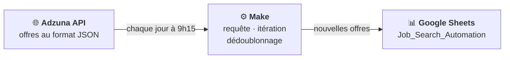

# 🔎 Automatisation  – Make × API × Google Sheets

> Un scénario no-code qui collecte chaque matin les nouvelles offres d'emploi Data autour de Nantes et les centralise, sans doublon, dans un Google Sheet qui me sert aussi de tableau de suivi de candidatures.


---

## 📌 Contexte

En recherche active d'un poste de **Data Analyst** dans la région nantaise, je consultais chaque jour plusieurs sites d'emploi à la main : beaucoup de temps perdu, des offres vues plusieurs fois, et aucune vision d'ensemble de mes candidatures.

**Objectif :** automatiser la collecte des offres pour :
- ne manquer aucune nouvelle offre ;
- éviter les doublons ;
- suivre mes candidatures au même endroit ;
- disposer d'un jeu de données exploitable pour analyser le marché.

---

## ⚙️ Architecture




### Étapes du scénario

1. **Déclencheur planifié** : exécution automatique chaque jour à 9h15
2. **Requête HTTP** vers l'API Adzuna (`/jobs/fr/search`) avec les paramètres :
   - `title_only=data` : mot-clé « data » dans l'intitulé du poste
   - `where=Nantes` & `distance=50` : Nantes et 50 km autour
   - `max_days_old=2` : offres publiées depuis moins de 2 jours
   - `sort_by=date` : les plus récentes en premier
   - `results_per_page=20` : 20 offres par appel
3. **Itérateur** : découpage de la réponse JSON (`data.results`) pour traiter les offres une par une
4. **Recherche dans Google Sheets** (*Search Rows*) : vérifie si l'ID de l'offre existe déjà dans le fichier
5. **Filtre « Nouveau job »** : seules les offres absentes du fichier passent → **aucun doublon**
6. **Ajout d'une ligne** (*Add a Row*) pour chaque nouvelle offre

---

## 📊 Données collectées

Le fichier combine des colonnes **remplies automatiquement** par Make et des colonnes de **suivi manuel** :

| Colonne | Source | Description |
|---|---|---|
| ID | Adzuna (`id`) | Identifiant unique de l'offre, clé de dédoublonnage |
| Titre du poste | Adzuna (`title`) | Intitulé de l'offre |
| Entreprise | Adzuna (`company.display_name`) | Nom de l'employeur |
| Type de contrat | Adzuna (`contract_type`) | `permanent` (CDI), `contract` (CDD)… |
| Lien | Adzuna (`redirect_url`) | URL vers l'offre complète |
| Date de candidature | Saisie manuelle | Date d'envoi de ma candidature |
| Date de réponse | Saisie manuelle | Date du retour de l'entreprise |
| Résultat | Saisie manuelle | Entretien, refus… |


---

## ✅ Résultats

- Veille quotidienne **entièrement automatisée**, sans intervention
- **55 offres** collectées depuis septembre 2026, **sans aucun doublon**
- Un seul fichier pour la veille **et** le suivi des candidatures

---

## 🧠 Compétences mobilisées

- Consommation d'une **API REST** (authentification par clé, paramètres de requête)
- Manipulation de données **JSON** (tableaux, objets imbriqués)
- Conception d'un **flux ETL** (Extract → Transform → Load)
- **Dédoublonnage** par clé unique
- **Automatisation** d'un processus métier en no-code
- Structuration de données pour l'analyse

---

## 🚀 Pistes d'amélioration

- Collecter aussi la localisation, la date de publication, les salaires et la description (champs déjà fournis par l'API)
- Tableau de bord **Looker Studio** : évolution du nombre d'offres, répartition par entreprise et par type de contrat
- Analyse **NLP** des descriptions de poste pour identifier les compétences les plus demandées

---

## 📁 Contenu du dépôt

```
├── README.md
├── blueprint.json        # Export du scénario Make (identifiants supprimés)
└── images/
    ├── make_scenario.png
    └── google_sheet.png
```

> ⚠️ Pour réutiliser le scénario : importer `blueprint.json` dans Make, puis renseigner vos propres `app_id` / `app_key` Adzuna (inscription gratuite sur [developer.adzuna.com](https://developer.adzuna.com)), votre connexion Google et votre Google Sheet.

---

## 👤 Auteure

**Xiaoqing ZHOU GRANDCOING** – Data Analyst
[Portfolio](https://xiaoqinggdc.github.io) · [LinkedIn](https://www.linkedin.com/in/xiaoqingzhougrandcoing) · [GitHub](https://github.com/XiaoqingGdc)
