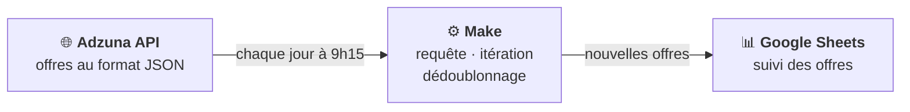
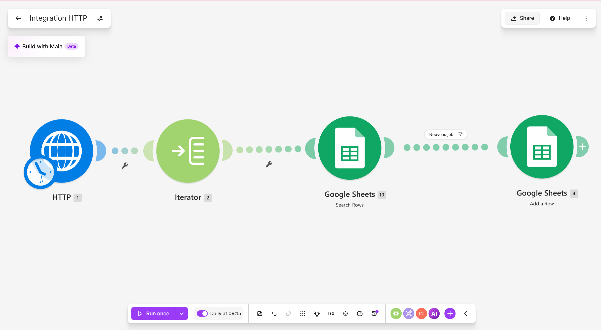
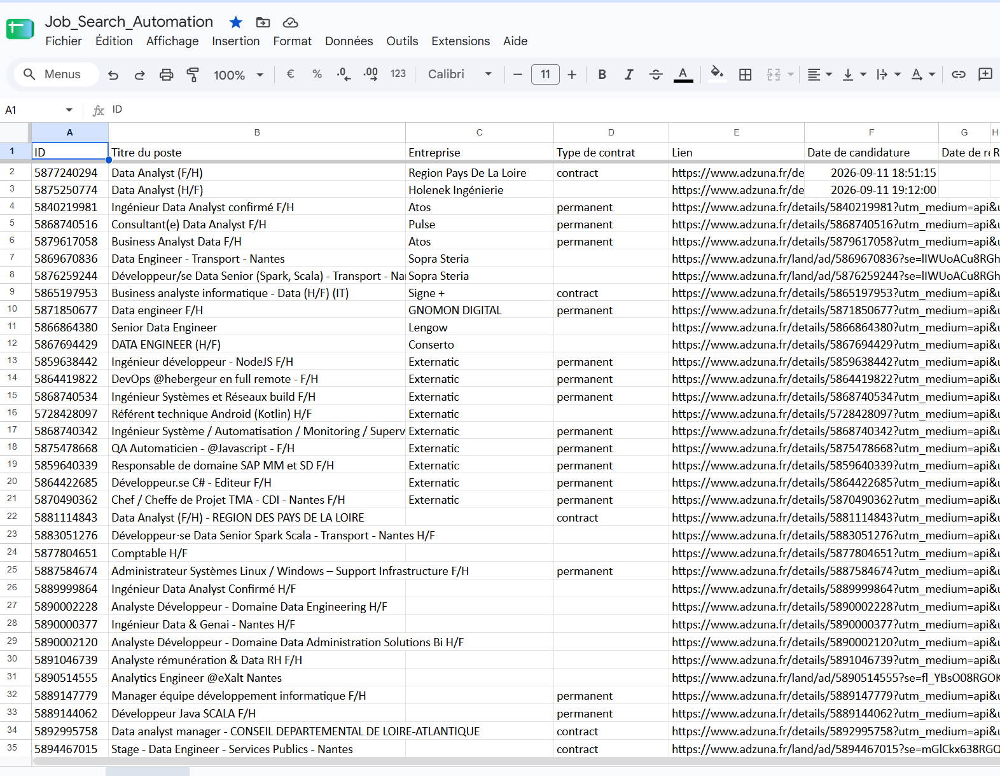

# 🔎 Automatisation – Make × API × Google Sheets

> Un scénario no-code qui collecte chaque matin les nouvelles offres d'emploi Data autour de Nantes et les centralise, sans doublon, dans un Google Sheet qui me sert aussi de tableau de suivi de candidatures.


---

## 📌 Contexte

Le suivi du marché de l'emploi **Data** en région nantaise repose souvent sur une veille manuelle : consultation quotidienne de plusieurs plateformes, offres en double d'un site à l'autre, et informations dispersées sans vision consolidée.

Ce projet propose un **pipeline automatisé de collecte et de structuration d'offres d'emploi**, pensé comme un cas d'usage concret d'intégration de données (API, automatisation no-code, stockage tabulaire).

**Objectifs :**
- collecter automatiquement les nouvelles offres publiées ;
- dédoublonner les annonces provenant de sources multiples ;
- centraliser le suivi des offres et de leur statut dans un référentiel unique ;
- constituer un jeu de données exploitable pour analyser le marché (volumes, compétences demandées, types de contrat, localisation).

---

## ⚙️ Architecture





### Étapes du scénario

1. **Déclencheur planifié** : exécution automatique chaque jour à 9h15
2. **Requête HTTP** vers l'API Adzuna (`/jobs/fr/search`) avec les paramètres :
   - `title_only=data` : mot-clé « data » dans l'intitulé du poste
   - `where=Nantes` & `distance=50` : Nantes et 50 km autour
   - `max_days_old=2` : offres publiées depuis moins de 2 jours
   - `sort_by=date` : les plus récentes en premier
   - `results_per_page=20` : 20 offres par appel
3. **Itérateur** : découpage de la réponse JSON (`data.results`) pour traiter les offres une par une
4. **Recherche dans Google Sheets** (*Search Rows*) : vérifie si l'ID de l'offre existe déjà dans le fichier
5. **Filtre « Nouveau job »** : seules les offres absentes du fichier passent → **aucun doublon**
6. **Ajout d'une ligne** (*Add a Row*) pour chaque nouvelle offre

---

## 📊 Données collectées

Le fichier combine des colonnes **remplies automatiquement** par Make et des colonnes de **suivi manuel** :

| Colonne | Source | Description |
|---|---|---|
| ID | Adzuna (`id`) | Identifiant unique de l'offre, clé de dédoublonnage |
| Titre du poste | Adzuna (`title`) | Intitulé de l'offre |
| Entreprise | Adzuna (`company.display_name`) | Nom de l'employeur |
| Type de contrat | Adzuna (`contract_type`) | `permanent` (CDI), `contract` (CDD)… |
| Lien | Adzuna (`redirect_url`) | URL vers l'offre complète |
| Date de candidature | Saisie manuelle | Date d'envoi de ma candidature |
| Date de réponse | Saisie manuelle | Date du retour de l'entreprise |
| Résultat | Saisie manuelle | Entretien, refus… |



---

## ✅ Résultats

- Veille quotidienne **entièrement automatisée**, sans intervention
- **55 offres** collectées depuis septembre 2026, **sans aucun doublon**
- Un seul fichier pour la veille **et** le suivi des candidatures

---

## 🧠 Compétences mobilisées

- Consommation d'une **API REST** (authentification par clé, paramètres de requête)
- Manipulation de données **JSON** (tableaux, objets imbriqués)
- Conception d'un **flux ETL** (Extract → Transform → Load)
- **Dédoublonnage** par clé unique
- **Automatisation** d'un processus métier en no-code
- Structuration de données pour l'analyse

---

## 🚀 Pistes d'amélioration

- Collecter aussi la localisation, la date de publication, les salaires et la description (champs déjà fournis par l'API)
- Tableau de bord **Looker Studio** : évolution du nombre d'offres, répartition par entreprise et par type de contrat
- Analyse **NLP** des descriptions de poste pour identifier les compétences les plus demandées

---

## 🛠️ Mode d'emploi – réutiliser le scénario

Vous cherchez un emploi ? Vous pouvez installer cette veille automatique pour vos propres critères en une vingtaine de minutes.

**Prérequis :** un compte [Make](https://www.make.com), un compte Google et une clé API Adzuna (gratuite).

1. **Obtenir une clé Adzuna**
   Créez un compte sur [developer.adzuna.com](https://developer.adzuna.com) et notez votre `app_id` et votre `app_key`.

2. **Préparer le Google Sheet**
   Créez un Google Sheet vide, puis importez le fichier [`modele_google_sheet.csv`](modele_google_sheet.csv) (*Fichier → Importer*).
   ⚠️ Les noms de colonnes doivent rester **exactement** identiques : le scénario s'appuie sur eux pour écrire les données.

3. **Importer le scénario dans Make**
   Créez un nouveau scénario, ouvrez le menu **⋯** puis **Import Blueprint**, et sélectionnez `blueprint.json`.

4. **Adapter la requête HTTP** (1er module)
   Dans l'URL, remplacez `YOUR_APP_ID` et `YOUR_APP_KEY` par vos identifiants, puis ajustez vos critères :
   - `title_only=data` → votre mot-clé (ex. `title_only=comptable`)
   - `where=Nantes` & `distance=50` → votre ville et votre rayon en km

5. **Connecter Google Sheets**
   Dans les modules *Search Rows* et *Add a Row*, ajoutez votre connexion Google, puis sélectionnez votre fichier et votre feuille. Vérifiez que les colonnes sont bien associées aux champs (`id`, `title`, `company: display_name`, `contract_type`, `redirect_url`).

6. **Tester puis planifier**
   Cliquez sur **Run once** et vérifiez que les offres apparaissent dans votre Sheet. Activez ensuite la planification (par exemple chaque jour à 9h).

> 💡 Chaque exécution consomme des opérations Make. Si vous dépassez le quota de votre offre, réduisez `results_per_page` ou la fréquence d'exécution.

---

## 📁 Contenu du dépôt

```
├── README.md
├── blueprint.json            # Export du scénario Make (identifiants supprimés)
├── modele_google_sheet.csv   # Modèle de Google Sheet (en-têtes de colonnes)
└── images/
    ├── make_scenario.png
    └── google_sheet.png
```

---

##  Auteure

**Xiaoqing ZHOU GRANDCOING** – Data Analyst
[Portfolio](https://xiaoqinggdc.github.io) · [LinkedIn](https://www.linkedin.com/in/xiaoqingzhougrandcoing) · [GitHub](https://github.com/XiaoqingGdc)
